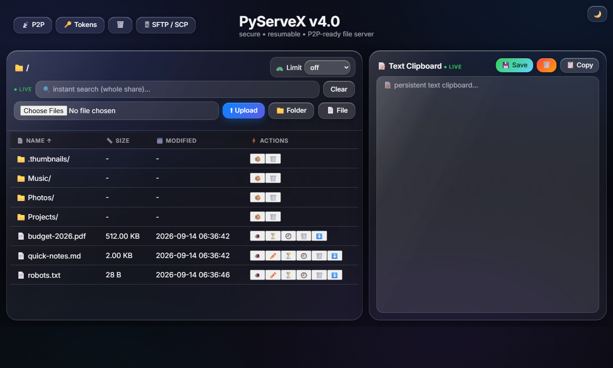

<div align="center">

# 🔗 PyServeX

**The zero-config file server that lives in your Downloads folder.**

Share a folder with your LAN, your phone, or the whole world — from one pure-Python process. No accounts, no database, no Docker, no build step.



*A real render of the PyServeX homescreen (Liquid Glass UI).*

📦 **pip install** · 🐍 **Python 3.8+** · ⚖️ **MIT**

</div>

---

## ✨ Why PyServeX?

| | |
|---|---|
| 🚀 **Instant** | `pyservx` and you're sharing. A QR code is even printed for your phone. |
| 🏠 **LAN-friendly** | Devices on your network never see a login screen. |
| 🔒 **Secure by default** | Anyone outside your network must authenticate. |
| 🔌 **Zero dependencies** | Pure Python stdlib. Optional extras only if you want them. |
| 🧩 **A Swiss-army knife** | Uploads, P2P, SFTP, tunnels, search, trash, AI-agent hooks. |

## 🎯 What you can do

- 📥 **Resumable uploads** — big files survive drop-outs; drag-and-drop whole folders, too.
- 🤝 **Peer-to-peer transfers** — bytes travel device-to-device over an encrypted WebRTC channel.
- ⏳ **One-time links** — `/e/<token>` URLs that self-destruct after use.
- 🔎 **Instant search** — names and file contents, indexed in the background.
- 🗑️ **Trash + version history** — undo deletions, roll back edits.
- 🔴 **Live refresh** — the page updates itself when files change.
- 🖥️ **SSH / SFTP** — `sftp://host:2222` with standard tools, jailed to the share.
- 🌍 **Public tunnel** — a real `https://…` URL without a public IP.
- 🤖 **MCP bridge** — point Claude or Cursor at `/mcp` and let an agent browse/edit files.
- 🔑 **API tokens** — bearer auth for scripts and integrations.
- 📝 **Web editor + notepad** — quick text edits from any device.

## 🚀 Quick start

```bash
pip install pyservx
pyservx                     # starts on :8088, shares ~/Downloads/PyServeX-Shared
```

Open the printed URL — **`http://<this-machine-ip>:8088`** — or scan the QR code with your phone.

On your LAN you're in immediately. Everyone else gets the login page; create your admin account with:

```bash
pyservx --username admin --password "change-me"
```

### Useful flags

| Flag | Effect |
|---|---|
| `--port 9000` | Change the HTTP port (default `8088`) |
| `--limit-speed 2M` | Cap every download (e.g. `2M`, `500K`) |
| `--ssh --ssh-port 2222` | Also expose SFTP/SCP |
| `--tunnel` | Public `https://` link (needs cloudflared / Tailscale / ngrok) |
| `--remote-bridge` | Browse another machine's SFTP from the UI (off by default) |
| `--dashboard` | Live stats terminal dashboard |
| `--local-only` | Keep auth on, but trust everyone (no logins) |

Full reference: `pyservx --help`. Settings persist across runs in `~/.pyservx_config.json`.

## 🔐 How authentication works

- **On your LAN** (192.168.x, 10.x, 172.16–31.x, localhost) — no login, ever.
- **Outside** — session cookie or `Authorization: Bearer <token>` (issue tokens on the `/tokens` page).
- Trust an extra subnet with `--allowed-networks 10.0.0.0/8`.
- Failed logins are rate-limited per IP (5 tries → 5-minute lockout).

Risky files never execute in your browser: scripts and executables download as attachments, web-y files open in a sandboxed viewer, and every response carries hardening headers.

## 🤖 Use it from an AI coding agent

PyServeX speaks [MCP](https://modelcontextprotocol.io) at `POST /mcp`:

- `list_files`, `read_file`, `write_file`, `upload_file`, `search_files`, `server_info` — all jailed to the shared folder.

Point your agent's MCP client at `http://<host>:8088/mcp` and it can work with your files through the same safety gates as the web UI.

## 🧪 Development & testing

```bash
git clone https://github.com/SubZ3r0-0x01/pyservx.git
cd pyservx
pip install -e .[ssh,dashboard]
python -m pytest tests -q          # unit + endpoint tests
python tests/integration_smoke.py  # 53 real-server checks
```

## 📁 Where your data lives

`~/Downloads/PyServeX-Shared` (shared) · `~/.pyservx_config.json` (settings) · `~/.pyservx_tokens.db` (tokens) · `~/.pyservx_uploads/` (in-flight uploads) · `~/.pyservx_trash/` (trash) · `~/.pyservx_versions/` (version history) · `~/.pyservx_logs/` (access log)

## 📜 License & links

MIT · [Source & issues](https://github.com/SubZ3r0-0x01/pyservx) · [Changelog](CHANGELOG.md) · [Contributing](CONTRIBUTING.md) · [Security](SECURITY.md)

*Built on the Python standard library. Optional extras: [paramiko](https://www.paramiko.org/) (SSH) and [rich](https://github.com/Textualize/rich) (dashboard).*